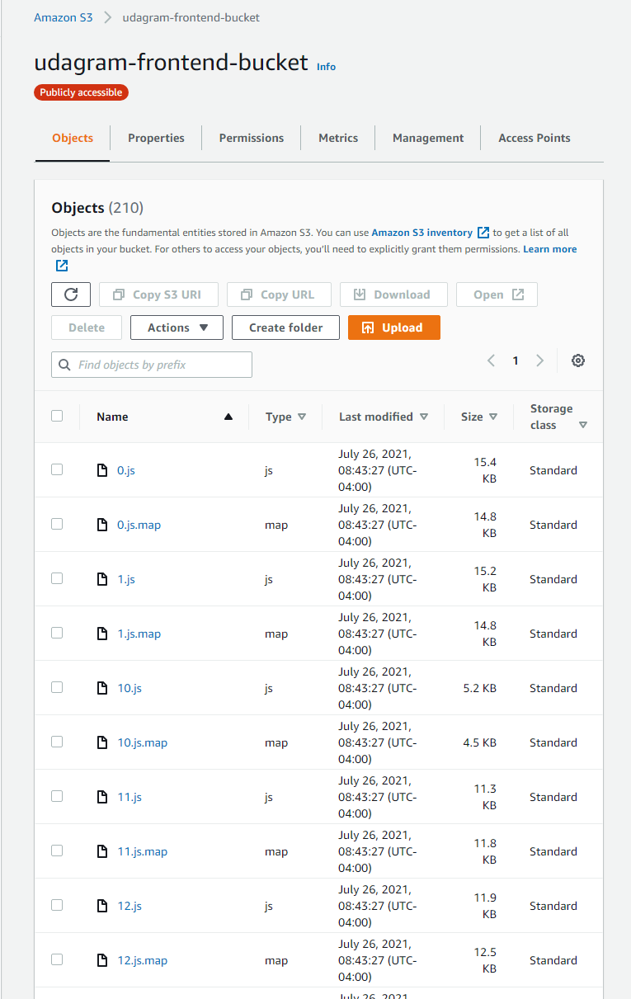
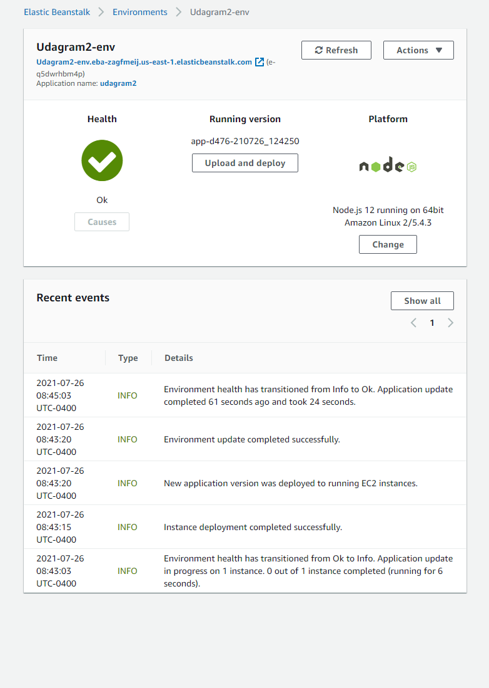
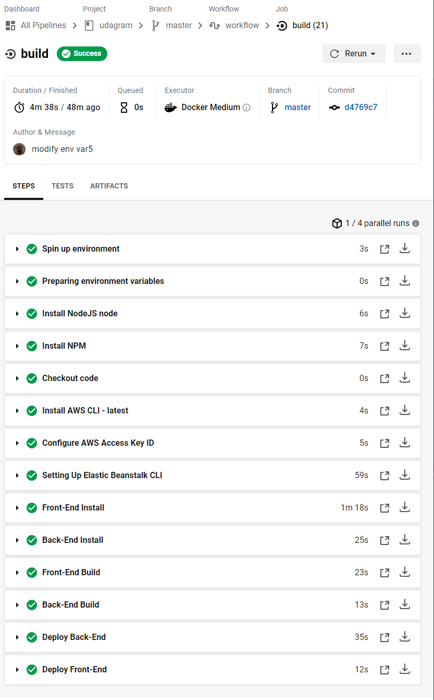
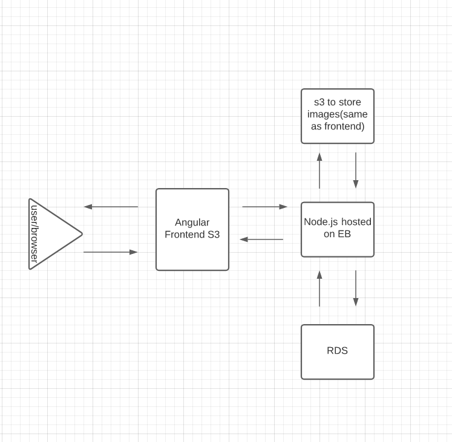

# Udagram

This application is a blog post app and the task is to
deploy it on AWS
This link will direct you to the app:

http://udagram-frontend-bucket.s3-website-us-east-1.amazonaws.com/

# Screenshots

## Amazon S3



## Application Environment



## RDS


## CirlceCI



## Architecture



### Dependencies

```
- Frontend:Node v14.15.1
- Backend:Node v12.0.0

- Frontend:npm 6.14.8
- Backend:npm 6.9

- AWS CLI v2
- EB CLI

- A RDS database running Postgres.

- A S3 bucket for hosting uploaded pictures.

```

## Built With

- [Angular](https://angular.io/) - Single Page Application Framework
- [Node](https://nodejs.org) - Javascript Runtime
- [Express](https://expressjs.com/) - Javascript API Framework

## License

[License](LICENSE.txt)
