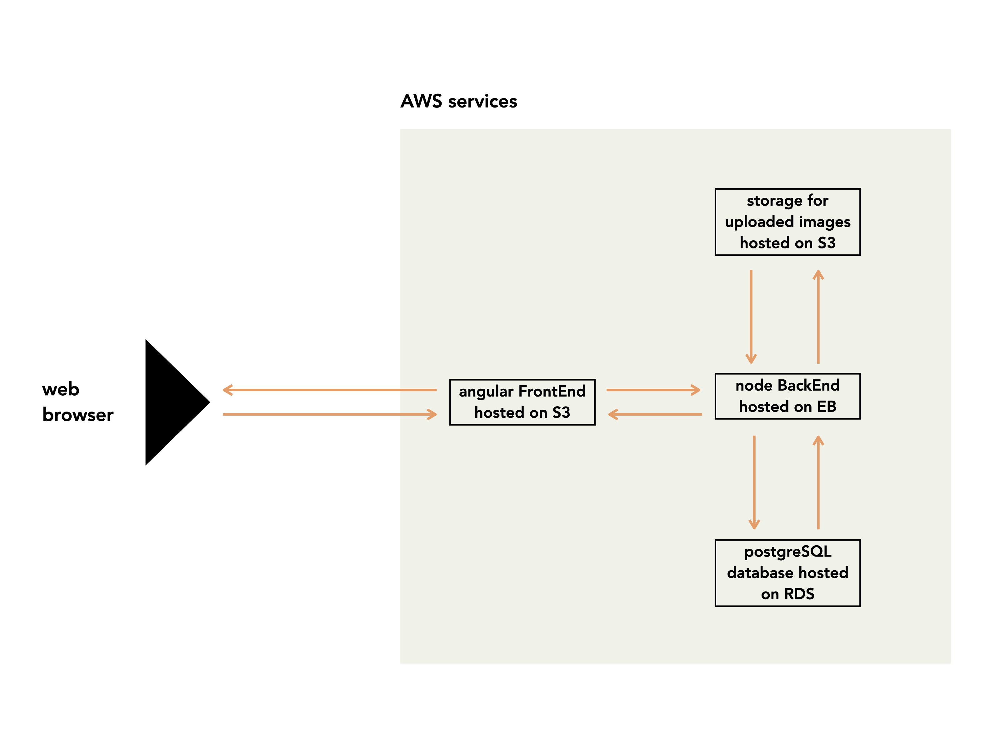

# Udagram

This application is a blog post app and the task is to
deploy it on AWS
This link will direct you to the app:

http://udagram-frontend-bucket.s3-website-us-east-1.amazonaws.com/

# Screenshots

## Amazon S3

## Application Environment

## RDS

## CirlceCI

## Env Variables

## Schema

## Architecture

## Built With

- [Angular](https://angular.io/) - Single Page Application Framework
- [Node](https://nodejs.org) - Javascript Runtime
- [Express](https://expressjs.com/) - Javascript API Framework

## License

[License](LICENSE.txt)
