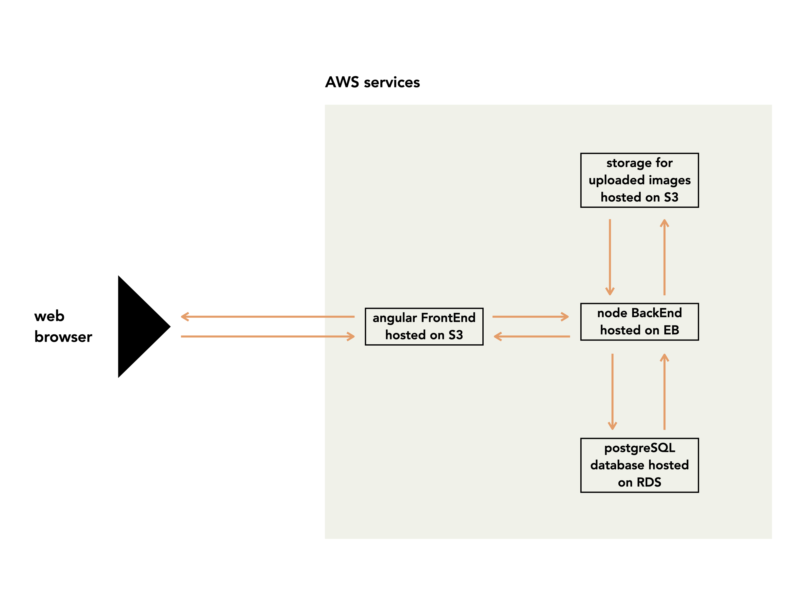

# Infrastructure

## AWS services in use

- **RDS**
  - A public accessible PostgreSQL database
- **S3**
  - Frontend hosting
  - Uploaded images(In this project I only created one s3 bucket)
- **Elastic Beanstalk**
  - Backend hosting

## Infrastracture Schema

